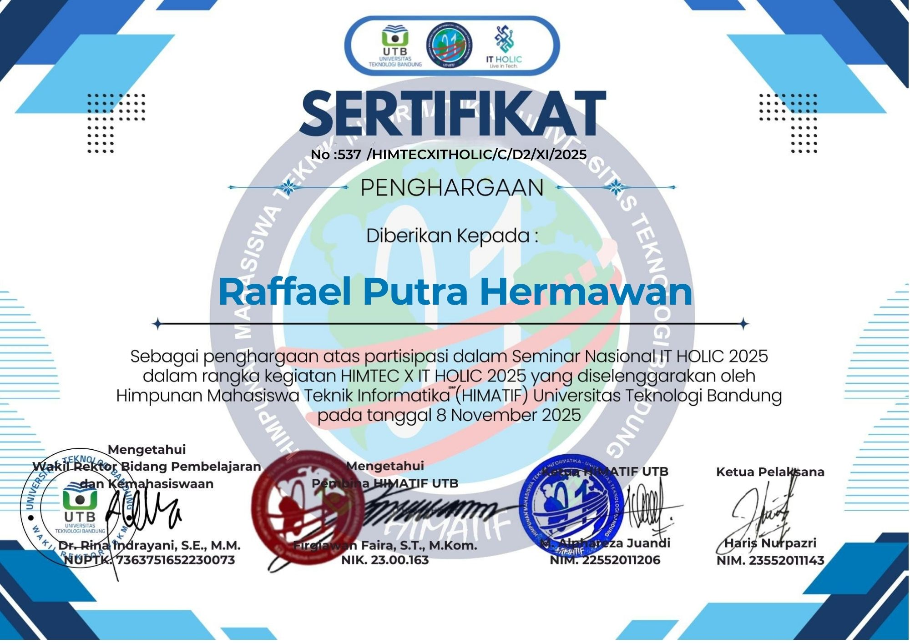
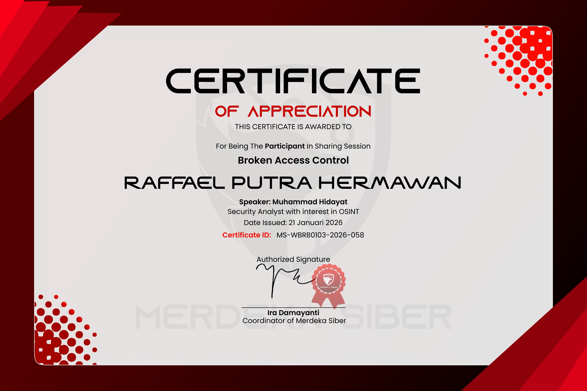
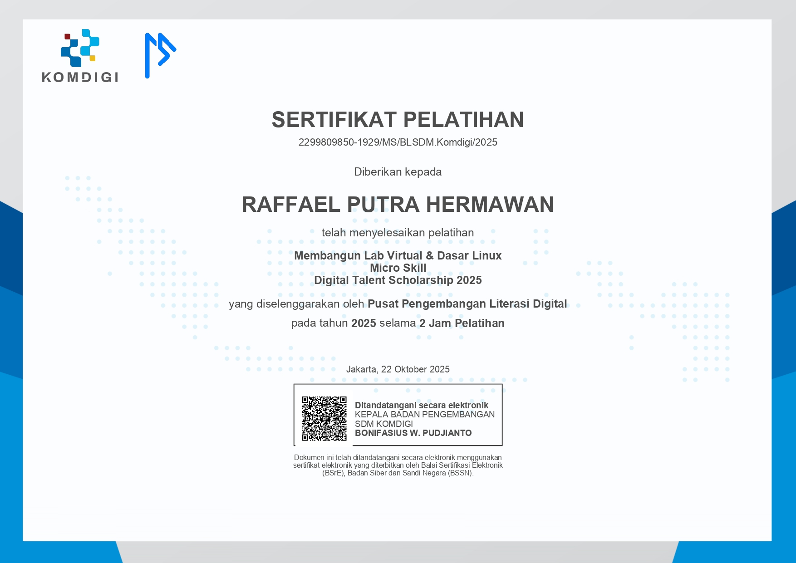
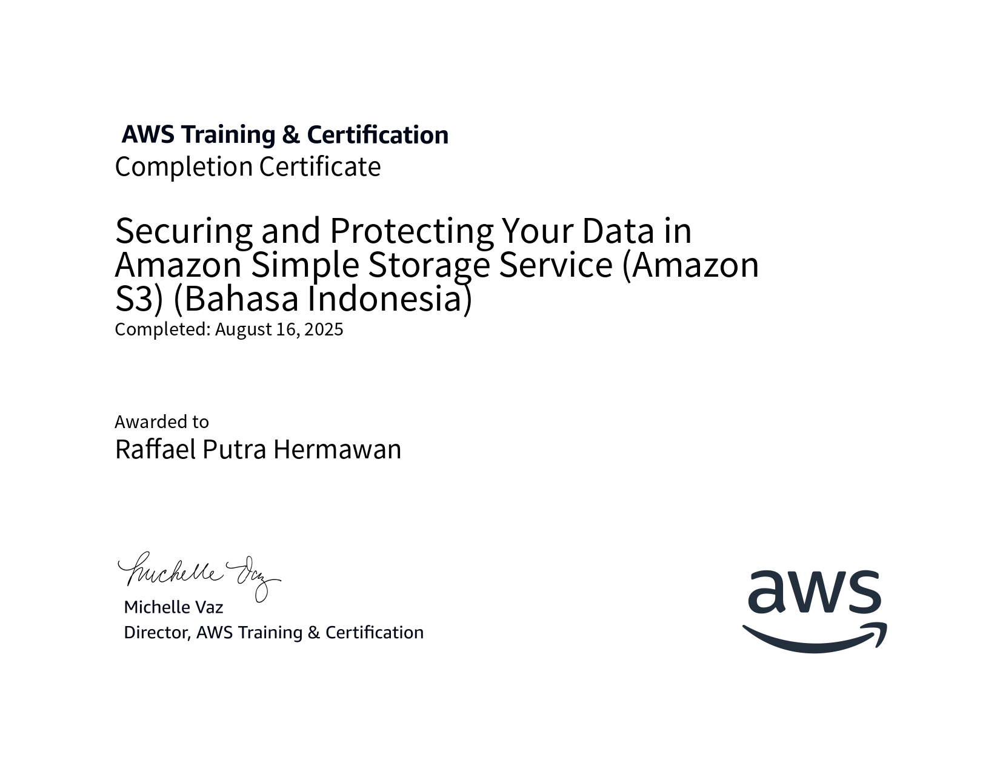

<div align="center">
  
</div>

<div align="center">
  
</div>

<div align="center">
  <br/>
  <a href="https://raffaelhub.my.id"></a>
  &nbsp;
  <a href="https://github.com/TheRealRafael00"></a>
  &nbsp;
  <a href="https://github.com/faelll14"></a>
  &nbsp;
  <a href="mailto:raffael.dev.sec@gmail.com"></a>
  <br/><br/>
  
  &nbsp;&nbsp;
  
</div>

<br/>


### About Me

I'm **Raffael Putra Hermawan** (Ell), a self-taught cybersecurity enthusiast and Python developer from **Indonesia**. My journey started in Termux, exploring tools and techniques that evolved into a deep passion for offensive security and intelligent automation.

Currently developing **Xylen Project** — a Telegram-based OSINT and Pentesting assistant built entirely in Python.

```yaml
alias        : Ell
location     : Indonesia
languages    : Indonesian | English | French | Russian
focus        :
  - Offensive Security & Red Team
  - OSINT Automation
  - Python Tool Development
  - Digital Forensics & Cyber Intelligence
open_to      :
  - Internships
  - CTF Teams
  - Research Collaborations
```

<br clear="right"/>

### Xylen Project


&nbsp; A Telegram Bot for OSINT and Pentesting automation — intelligent, modular, Python-powered.

<br/>

| Module | Description |
|:--|:--|
| `OSINT Search` | Cross-platform data gathering |
| `FileInt` | File metadata & EXIF extraction |
| `QRGen` | Advanced QR generator with color & transparency |
| `PhoneInt` | Phone number info and ISP lookup |
| `URL Checker` | Deep link inspection and IP resolution |
| `AutBugHunt` | Automated bug scan via curl and request probing |

<br/>

### Skill Matrix

```
Termux Commands       ████████████████████  90%
Python Programming    ███████████████░░░░░  75%
Social Engineering    ██████████████░░░░░░  72%
OSINT                 ██████████████░░░░░░  70%
Cyber Intelligence    ████████████░░░░░░░░  60%
IoT Systems           ████████████░░░░░░░░  60%
Ethical Hacking       ██████████░░░░░░░░░░  50%
Kali Linux Commands   ██████░░░░░░░░░░░░░░  30%
```

### AI Tools Proficiency

<div align="center">
  
</div>

Proficient in leveraging large language models and AI assistants as part of daily development, security research, and automation workflows. Not just a user — I integrate AI into my toolchain for code generation, threat analysis, OSINT correlation, and rapid prototyping.

| Model | Use Case |
|:--|:--|
| `ChatGPT` | Code generation, debugging, security writeups |
| `Claude` | Long-form reasoning, code review, documentation |
| `Gemini` | Multimodal analysis, research synthesis |
| `Grok` | Real-time intelligence, social OSINT context |
| `DeepSeek` | Technical deep dives, math-heavy problems |
| `Blackbox AI` | In-editor code completion and refactoring |

<br/>

### Projects

All active projects and repositories are available at **[github.com/TheRealRafael00](https://github.com/TheRealRafael00)** — including Xylen Project and other security tools, Python bots, and automation scripts in development.

<br/>

### Tech Stack

<div align="center">
  
  <br/>
  
  <br/>
  
</div>

<br/>

<div align="center">

**Security Tools** &nbsp;·&nbsp; `Burp Suite` `Metasploit` `Nmap` `Wireshark` `Aircrack-ng` `Hydra` `Hashcat` `John the Ripper` `SQLmap` `Nikto` `Gobuster` `Wifite` `Bettercap` `Amass` `Subfinder` `theHarvester` `Recon-ng` `Kismet` `tcpdump` `Netcat`

**Environments** &nbsp;·&nbsp; `Kali Linux` `BlackArch` `Ubuntu` `Termux` `VirtualBox` `VMware` `QEMU` `GNS3` `EVE-NG` `Cisco Packet Tracer`

</div>

<br/>

### Certifications

> Upload all cert images (`my.jpg`, `myy.jpg`, ...) to the root of this repo for images to display.

<div align="center">
<table>
<tr>
<td align="center"><br/><sub><b>CC Course Conclusion</b></sub><br/><sub>ISC2</sub></td>
<td align="center"><br/><sub><b>Classical Cryptography for Beginners</b></sub><br/><sub>Cyberacademy.id</sub></td>
<td align="center"><br/><sub><b>Intro to Dark Web, Anonymity & Crypto</b></sub><br/><sub>EC-COUNCIL</sub></td>
<td align="center"><br/><sub><b>ChatGPT for Cybersecurity</b></sub><br/><sub>Simplilearn</sub></td>
</tr>
<tr>
<td align="center"><br/><sub><b>Cybersecurity Essentials with Kali Linux</b></sub><br/><sub>BISA AI</sub></td>
<td align="center"><br/><sub><b>Cyber Threat Intelligence 101</b></sub><br/><sub>arcX</sub></td>
<td align="center"><br/><sub><b>Cybersecurity Fundamentals</b></sub><br/><sub>IBM Skills Build</sub></td>
<td align="center"><br/><sub><b>CompTIA Security+</b></sub><br/><sub>Cursa</sub></td>
</tr>
<tr>
<td align="center"><br/><sub><b>Ethical Hacker</b></sub><br/><sub>Cisco Networking Academy</sub></td>
<td align="center"><br/><sub><b>Ethical Hacking: Introduction</b></sub><br/><sub>Cybrary</sub></td>
<td align="center"><br/><sub><b>Introduction to Cybersecurity</b></sub><br/><sub>Cisco Networking Academy</sub></td>
<td align="center"><br/><sub><b>Cybersecurity for Business</b></sub><br/><sub>EC-COUNCIL</sub></td>
</tr>
<tr>
<td align="center"><br/><sub><b>Introduction to Cybersecurity</b></sub><br/><sub>Cyberacademy.id</sub></td>
<td align="center"><br/><sub><b>IT Security by Google Careers</b></sub><br/><sub>Cursa</sub></td>
<td align="center"><br/><sub><b>Google Analytics Certification</b></sub><br/><sub>Google</sub></td>
<td align="center"><br/><sub><b>Fortinet Certified Associate</b></sub><br/><sub>Fortinet</sub></td>
</tr>
<tr>
<td align="center"><br/><sub><b>Prompt Engineering</b></sub><br/><sub>Codecademy</sub></td>
<td align="center"><br/><sub><b>DevSecOps in AWS Course</b></sub><br/><sub>Codecademy</sub></td>
<td align="center"><br/><sub><b>Securing and Protecting Data</b></sub><br/><sub>Amazon</sub></td>
<td align="center"><br/><sub><b>Ethical Hacker for Dummies</b></sub><br/><sub>Komdigi / Kominfo</sub></td>
</tr>
<tr>
<td align="center"><br/><sub><b>CyberSecurity</b></sub><br/><sub>ADBI Institute</sub></td>
<td align="center"><br/><sub><b>Certificate of Participation</b></sub><br/><sub>HackerVerse / EC-COUNCIL</sub></td>
<td align="center"><br/><sub><b>How to Prevent E-Waste?</b></sub><br/><sub>United Nations</sub></td>
<td align="center"><br/><sub><b>SQL Basic</b></sub><br/><sub>HackerRank</sub></td>
</tr>
<tr>
<td align="center"><br/><sub><b>SQL Intermediate</b></sub><br/><sub>HackerRank</sub></td>
<td align="center"><br/><sub><b>SQL Advanced</b></sub><br/><sub>HackerRank</sub></td>
<td align="center"><br/><sub><b>Belajar Dasar AI</b></sub><br/><sub>Dicoding — Indosat — Google Cloud</sub></td>
<td align="center"><br/><sub><b>Seminar Nasional IT Holic</b></sub><br/><sub>Himatif UTB</sub></td>
</tr>
<tr>
<td align="center"><br/><sub><b>Webinar Broken Access Control</b></sub><br/><sub>Merdeka Siber</sub></td>
<td align="center"><br/><sub><b>Membangun Lab Virtual dan Dasar Linux</b></sub><br/><sub>Digital Talent Scholarship — Komdigi</sub></td>
<td align="center"><br/><sub><b>Securing Your Data in Amazon S3</b></sub><br/><sub>AWS Training & Certification</sub></td>
<td align="center"></td>
</tr>
</table>
</div>

<br/>

### GitHub Analytics

<div align="center">
  
  
  <br/><br/>
  
  <br/><br/>
  
</div>

<br/>

<div align="center">
  
  <br/>
  <sub>© 2026 Raffael Putra Hermawan · All Rights Reserved · No content may be copied or redistributed without explicit written permission.</sub>
</div>
